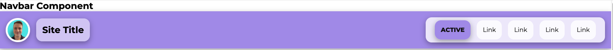
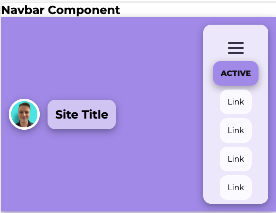
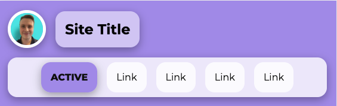
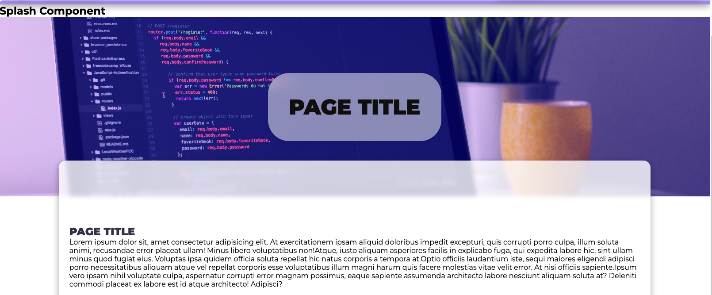
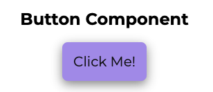
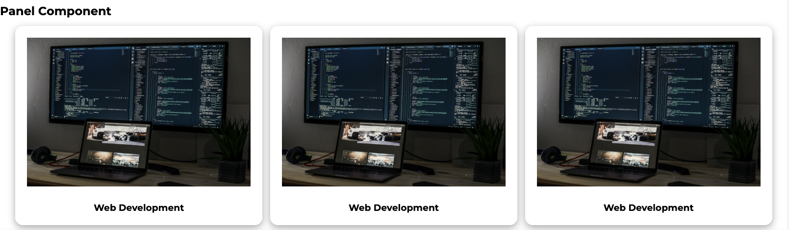
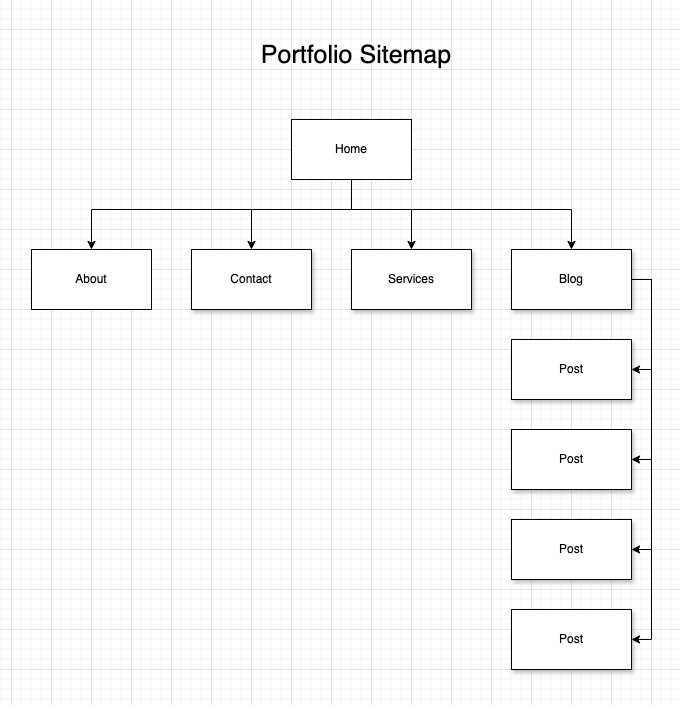

# Coder Academy Diploma of IT - T1A2 Portfolio - Ethan Cornwill

## Purpose
The purpose of this website is to serve as an online portfolio showcasing the skills, interests, and professional knowledge of myself, in relation to web development and this course.
I aim to display the work and coding experience of myself, effectively communicating my abilities to potential employers.

## Functionality / features
The site features a portfolio of my work, as well as my personal blog.
Some features that it includes:

### Components

#### Navbar
This component serves as the primary navigation tool of the website. It includes links to the main sections of the site, such as Home, About, Services, Contact, and Blog. It’s designed to be responsive and user-friendly, allowing visitors to easily find what they’re looking for.

#### Splash

#### Button

#### Panel

#### Footer

## Screenshots

## Sitemap

## Target audience
The target audience for this site is prospective employers who are looking to hire my services. This website serves as a portfolio of my work, as well my personal blog.

## Tech stack (e.g. html, css, deployment platform, etc)
The site is deployed using GitHub Pages. This is a free tool provided by GitHub that allows you to host static websites on GitHub's servers.

My Published website is available here [Website](https://finneh4249.github.io/ethan-cornwill-t1a2-portfolio/).
[GitHub Repo](https://github.com/finneh4249/ethan-cornwill-t1a2-portfolio).

