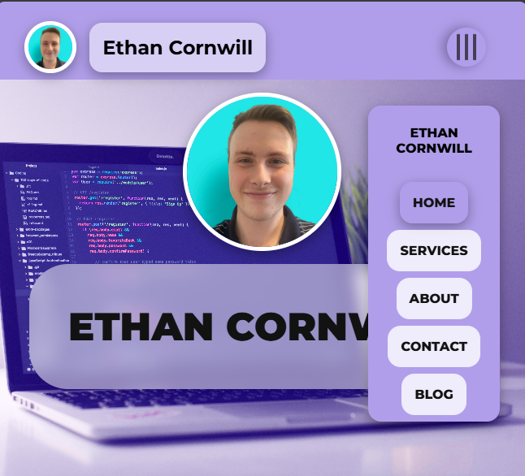
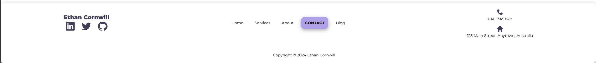

# Coder Academy Diploma of IT - T1A2 Portfolio - Ethan Cornwill

## Purpose

The purpose of this website is to serve as an online portfolio showcasing the skills, interests, and professional knowledge of myself, in relation to web development and this course.
I aim to display the work and coding experience of myself, effectively communicating my abilities to potential employers.

## Functionality / features

The site features a portfolio of my work, as well as my personal blog.
Some features that it includes:

### Custom CSS Framework

This website includes a custom CSS framework that I coded from scratch which allowed me to quickly create new pages once it was created.

### Components

#### Navbar

This component serves as the primary navigation tool of the website. It includes links to the main sections of the site, such as Home, About, Services, Contact, and Blog. It’s designed to be responsive and user-friendly, allowing visitors to easily find what they’re looking for.

- Navbar on desktop
  - 

- Navbar on Mobile
  - 

The navbar is controlled using a javascript function that toggles an active class in CSS that modifies the positioning of the navigation panel.

#### Splash

The splash component is the first thing visitors see when they land on a page. It’s designed to grab attention using the secondary shade of the purple colours. This is a full-width image and heading combination that highlights the main content of the page.

#### Button

Buttons are essential for guiding users through the website’s interface. They are used for calls to action, such as “Hire Me”, “Contact Me”, and "Read More".

#### Panel

Panels are used to segment and organise content in a visually appealing way. They can hold text, images, forms, or other elements and are used to create a clean and structured layout.

#### Footer

The footer is found at the bottom of every page and contains important information like contact details, social media links, site navigation, and legal information.

## Screenshots

### Sitemap

\

### Wireframes

#### Home Page

#### About Page

#### Contact Page

#### Services Page

#### Blog Home

#### Blog Post

## Target audience

The target audience for this site is prospective employers who are looking to hire my services. This website serves as a portfolio of my work, as well my personal blog.

## Tech stack (e.g. html, css, deployment platform, etc)

The site is deployed using Netlify. This is a free tool providedthat allows you to host static and dynamic websites.

My Published website is available here [Website](https://ethan-cornwill-t1a2-portfolio.netlify.app/).
[GitHub Repo](https://github.com/finneh4249/ethan-cornwill-t1a2-portfolio).
